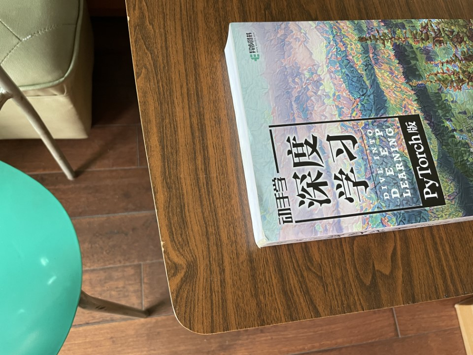
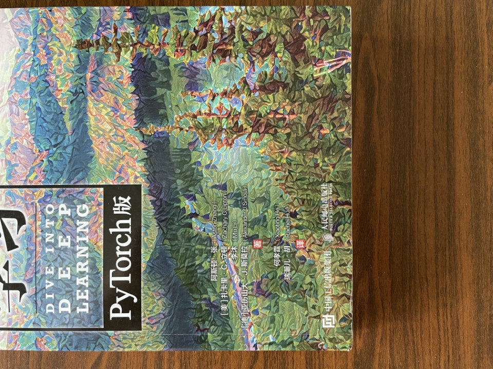
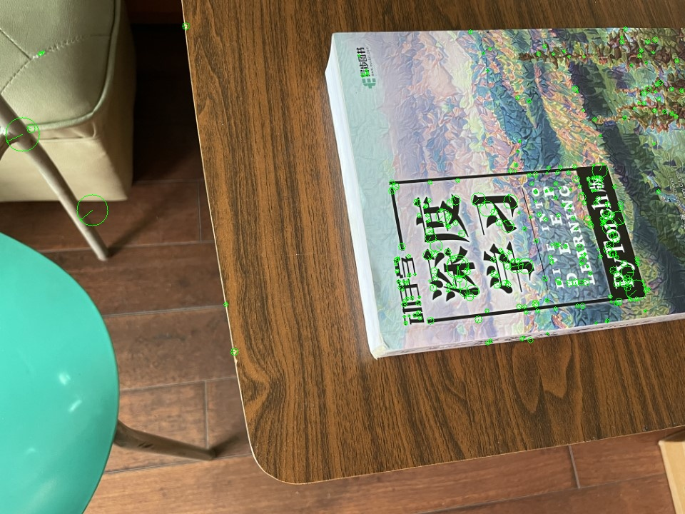
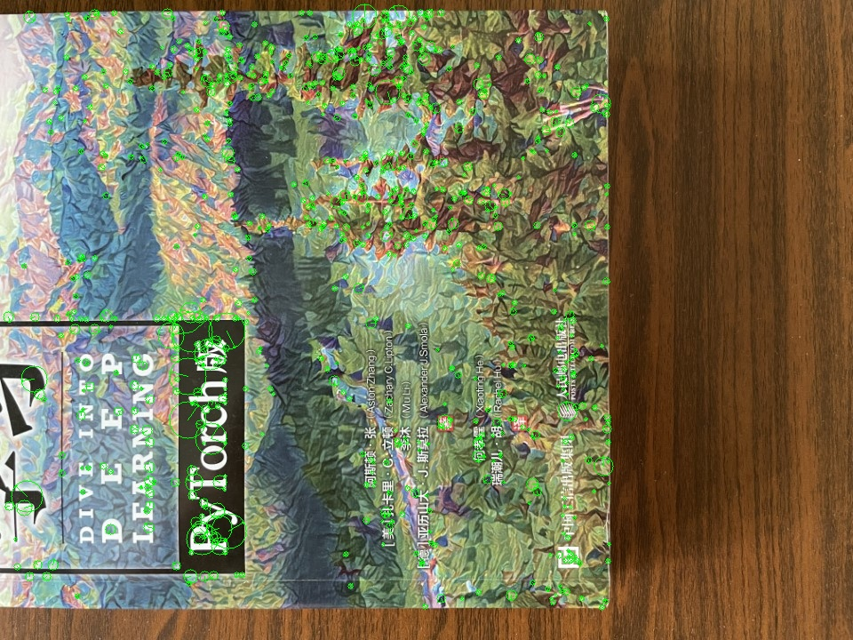
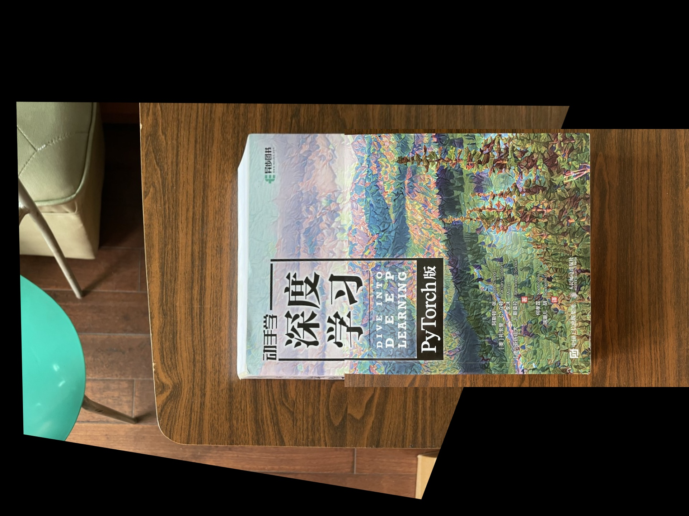

# Java SIFT

[中文版](README-zh.md)

## Introduction

A Java implementation of the SIFT algorithm ([Lowe 2004] Distinctive Image Features from Scale-Invariant Keypoints).

## Environment Setup

### Operation Environment

This repo has been tested in the following environment:

- Windows 10 22H2
- IntelliJ IDEA 2023.1.2
- JDK 14.0.2

### Dependencies

- jblas 1.2.4 [mikiobraun/jblas @ GitHub](https://jblas.org/)
- OpenCV 4.7.0 [OpenCV - Open Computer Vision Library](https://opencv.org/)

## How to Use

1. Download the dependencies and include them into your project. You may also need to add the dynamic link libraries under "OpenCV/build/java" to the Java library path.

2. Include the code in this repo into your project.

3. To detect key points and compute descriptors, you need to first convert the image to a grayscale image in the range of [0,1], and then run the following code:

   ```java
   SIFT sift = new SIFT(grayFloat);
   ArrayList<KeyPointX> keyPointsWithDescriptor = sift.run();
   ```

   The returned `KeyPointX` objects include key points' information of CV's `KeyPoint` type and a descriptor of jblas' `FloatMatrix` type.

4. To visualize key points, you need to extract the `KeyPoint` objects from `KeyPointX`es, organize them into an `ArrayList`, and then call `Visualization.visualize()`:

   ```java
   ArrayList<KeyPoint> keyPoints = new ArrayList<>(keyPointsWithDescriptor.size());
   for (KeyPointX keyPointX : keyPointsWithDescriptor)
   	keyPoints.add(keyPointX.keyPoint);
   Mat imageWithMark = Visualization.visualize(image, keyPoints, true, true);
   imshow("Image with Mark", imageWithMark);
   waitKey();
   ```

5. To write key points and descriptors to the file, call the `writeKeyPointXes()` and `readKeyPointXes() ` methods of `IOUtil`:

   ```java
   String filePath = "KeyPointList.dat";
   IOUtil.writeKeyPointXes(keyPointsWithDescriptor, filePath, false);
   ArrayList<KeyPointX> recoveredList = IOUtil.readKeyPointXes(filePath);
   ```

### Examples

There are two test images "book1.jpg" and "book2.jpg" under the "example" folder:

 

By detecting and visualizing the key points on the test image, you can get the following results:

 

The detected key points and descriptors can be used for downstream operations. 
For example, by using OpenCV to calculate the homography matrix and doing image stitching, you can get a result similar to the following image:



## Known Issues

- Many key points are removed in the step of "accurate key point localization", resulting in fewer remaining key points. It may be caused by improper operation when normalizing the image to the range of [0,1].
- The robustness of this implementation is not very high. Under circumstances of large-scale perspective transformations, some key points may not be detected, and the problem of direction reversal has been observed on some of the key points.

## Other Notes

### On the meaning of each field of `KeyPoint`:

In this implementation, the meaning of each field in `KeyPoint` is slightly different from the OpenCV convention. The meaning of each field in this implementation is listed:

- `pt` - The local coordinate of the key point in the image, not aligned with the input image or "base image". For example, let the size of the input image be `w*h`, then the local coordinate of a key point in the next octave is within the range of `[0,w/2]` and `[0,h/2]`。
- `size` - The global scale of the key point in the whole scale-space.
- `angle` - The gradient direction of the key point; expressed in angle system, the value is within range (0,360°). A key point may correspond to multiple directions, depending on the gradient directions of the pixels around the point.
- `response` - DoG response of the key points.
- `octave` - The sequence number of the octave to which the key point belongs, starting from 0.
- `class_id` - Unused field, the default value is -1.